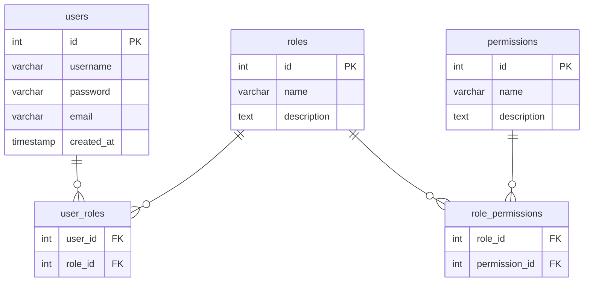

```mermaid
erDiagram
    users ||--o{ user_roles : ""
    roles ||--o{ user_roles : ""
    roles ||--o{ role_permissions : ""
    permissions ||--o{ role_permissions : ""

    users {
        int id PK
        varchar username
        varchar password
        varchar email
        timestamp created_at
    }
    roles {
        int id PK
        varchar name
        text description
    }
    permissions {
        int id PK
        varchar name
        text description
    }
    user_roles {
        int user_id FK
        int role_id FK
    }
    role_permissions {
        int role_id FK
        int permission_id FK
    }
```

Bạn có thể xem file này bằng extension Mermaid trong VS Code hoặc trên mermaid.live.
